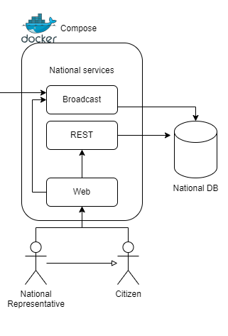
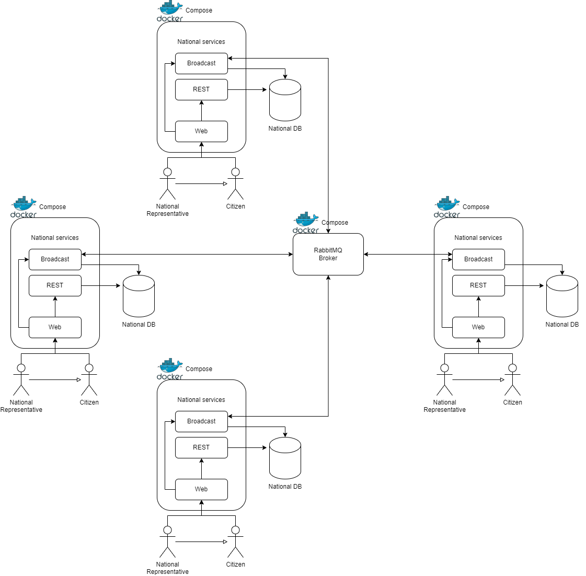

# European-Referendum-Online

## Introduction

The purpose of this report is to describe our 3 months work in the context of an implementation of a distributed system. This project outlines the objectives of a system ideally commissioned by the European Union. The system is designed to facilitate inter-nation communication, enabling consensus-building and the ex-change of locally collected data and public opinions. It aims to provide participating countries with essential resources for the accurate formulation of new referendums, subject to the vote of both national and European citizenship.

## Main services
The system is build on Docker to allow an easy installation and usage for the users. Using this platform, we have implemented a distributed system in which every Nation has its own services. In particular every Nation has:



* Web: this is the web interface. The service uses the REST API to manipulate national data and ensure its persistence through the web interface. It also uses the Broadcast API to exchange messages with other nations.

* Broadcast APIserver: this servant is a programming interface that enables the simultaneous distribution of data, messages, or content to multiple recipients or channels, facilitating efficient and real-time communication across various platforms or devices.

* REST API server: this component is a web-based communication protocol that allows clientsto request and manipulate resources on a server using standard HTTP methods.

* PostgreSQL database: the database serves as a repository for national data, encompassingcitizen credentials, European referendums, and associated consensus data structures.

Standalone services:

* RabbitMQ broker: this node is needed for making asynchronous communication possible be-tween the servers in charge of dispatching the messages between the organization workers. Eachnation establishes its own queue on this broker and designates a routing key. When a nationdesires to send a broadcast message, it selects a routing key that matches all the nations, allowing them to receive the message in their respective queues. Once the message has been read, it will be automatically removed from the queue.



## Components communication and usefull links

For development purposes, all the system’s deployments were made accessible within the local network, allowing developers to test each component at the localhost address. This setup eliminated the need for multiple machines and simplified the testing process. To achieve this, various host entries were created under the same remote address, which were named in a way that reflected the functionality they exposed.

These components seamlessly communicated with each other through the network established by the Docker deployment, enabling efficient testing and development. The link for the different services are the following. We have divided into the different nation that we have implemented for the simulation (we have used 3 nations for the simulation).

For Italy:

http://localhost:8080/ ← web-ita

http://localhost:8081/ ← rest-ita

http://localhost:8082/ ← broadcast-ita

For France:

http://localhost:8084/ ←web-fra

http://localhost:8085/ ← rest-fra

http://localhost:8086/ ← broadcast-fra

For Germany:

http://localhost:8088/ ← web-ger

http://localhost:8089/ ← rest-ger

http://localhost:8090/ ← broadcast-ger

Then, there is the address to manage RabbitMQ:

http://localhost:15672/ ← RabbitMQ admin

## Dependencies

Spring Boot is an open-source framework for building Java applications, designed to simplify development with minimal configuration. It provides an embedded web server, auto-configuration, and seamless integration with the Spring ecosystem. Spring Boot applications can be run as standalone Java applications and are suitable for various use cases, including web applications and microservices. It emphasizes Java-based configuration and properties files, reducing the need for XML configuration. Spring Boot is actively maintained and has a rich ecosystem of libraries and extensions, making it a popular choice for modern Java development.

**All the services are Spring-Boot project.**

To allow the correct implementation, we have imported different dependencies for the services. Inparticular:
* Web service: Thymeleaf, Spring Boot Starter Web, Spring DevTools, and Spring Boot Starter Test:
* Rest service: Spring Data JPA, Spring Boot Starter Web, Spring DevTools, Spring Boot Starter Test, and PostgreSQL.
* Broadcast service: Spring Boot Starter AMQP, Spring Boot Starter Web, Spring DevTools, Spring Boot Starter Test, Spring Rabbit Test, and Google Gson.

The plugins used for every service are:
* org.springframework.boot: used to package the Spring Boot application.
* org.apache.maven.plugins: used to configure Surefire to skip tests during the build.

## How to deploy the system for the first time

The only requirement is Docker. All the data and programs will be installed downloading and launching the Github code:

Clone the repository executing the following CLI command:
```
git clone git clone https://github.com/RicGobs/EPO-European-Parliament-Online.git
```

Now, you have to launch the program. Launch in four different terminal the following commands:
```
sudo docker compose -f docker-compose-all.yaml up --build

# Wait until rabbitmq container ends the initialization

sudo docker compose -f docker-compose-ita.yaml up --build
sudo docker compose -f docker-compose-fra.yaml up --build
sudo docker compose -f docker-compose-ger.yaml up --build

# - - - - - - - - -

# Alternative for linux users (on single terminal): 

chmod u+x command_start.sh 
./command_start.sh 
```

It is possible to have some errors. We will give you some useful commands to solve the easiest issues:

Sometimes, the port neeeded for the program are already used; so use the following commands:

```
# to check which ports are in use
sudo lsof -i -P -n | grep LISTEN

# to kill the process running in port 5672
sudo fuser -k 5672/tcp

# to kill the process running in port 5432
sudo fuser -k 5432/tcp
```

Sometimes, docker gives some problems with old containers; so, to eliminate old containers that can create conflicts:
```
sudo docker container rm /rabbitmq
sudo docker container rm /sender
sudo docker container rm /receiver
sudo docker container rm /web
sudo docker container rm /rest
```
if you use this command with /psql, you will delete this container and lose all data stored in the database.

In the end, to clean your system from all docker containers and volumes:
```
sudo docker system prune --all --force
```
 
## Conclusions and Future improvements

The main purpose of this project is to experiment the consensus in a distributed voting system across nations. Despite the implementation of a distributed algorithm, which overcomes the limitation of the legacy centralized voting environment and make the system more secure by design, security is not the main focus of our system. But this is a crucial aspect in the real world.

In fact, the vast majority of recent e-voting systems are based on blockchain, which guarantees the confidentiality (absence of unauthorized disclosure of information), the integrity (absence of unauthorized system alterations) and the validity (respected logical constraints) of the voting process, as well as availability for authorized actions. In detail, a common used method to is the Proof-of-Voting (PoV), preferred over the common PoW for its lower cost and lower power consumption, by keeping security satisfied. An example of these systems is, where hierarchical voting roles are defined, each one associated to a smart contract. The method used to reach consensus is PoV, useful also to identify Byzantine processes in order to remove them from the blockchain. The main idea is to assure that only a specific voter could have cast his own vote. Other recent systems seem to be all different implementations of the same blockchain-based solution idea. So, it seems natural to think that a future improvement of our system can be to integrate some security measures in order to avoid attacks to the system functioning principle.


## People

| People | Linkedin | Github |
|--- |--- |--- |
| Riccardo Gobbato | [Linkedin](https://www.linkedin.com/in/riccardo-gobbato-380674251/) | [Github](https://github.com/RicGobs) |
| Simone Scaccia | [Linkedin](https://www.linkedin.com/in/simone-scaccia-40b631210/) | [Github](https://github.com/simonescaccia) |
| Pasquale Mocerino | [Linkedin](https://www.linkedin.com/in/pasquale-mocerino-29088b1a2/) | [Github](https://github.com/pasqualemocerino) |
| Chiara Maggi | [Linkedin](https://github.com/Chiaggi) | [Github](https://github.com/Chiaggi) |
